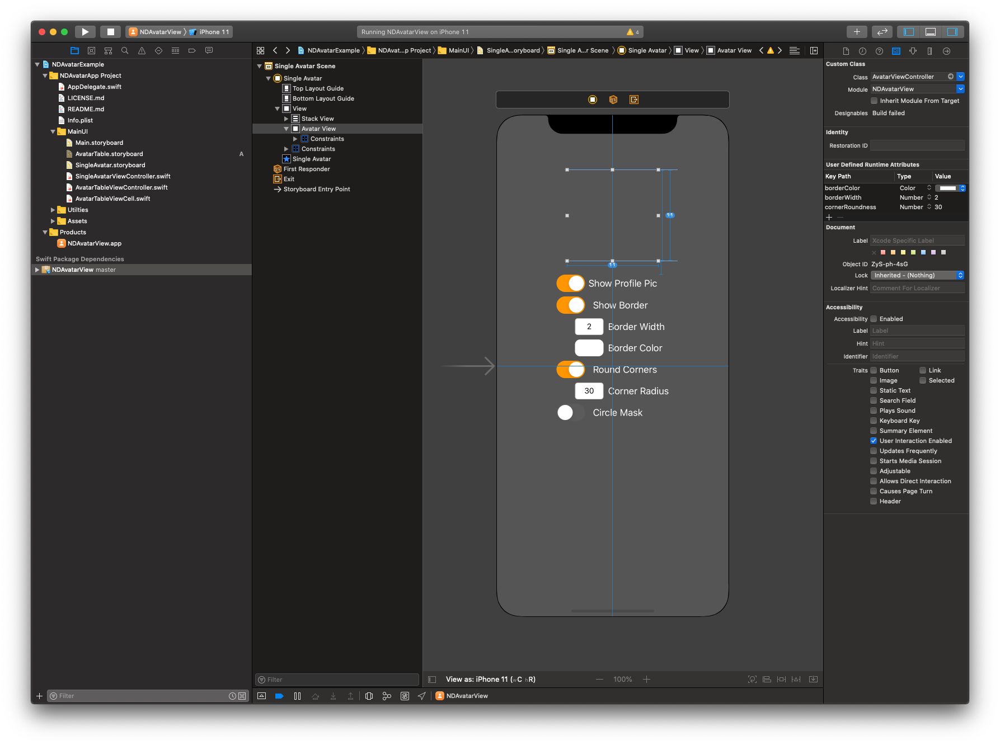

[](https://opensource.org/licenses/mit-license.php)
[](https://developer.apple.com/swift)


Preview the great functionality of the NDAvatar framework with this example app. NDAvatar is a Swift framework for displaying profile pictures or user initials in a consistent and easy way. This app utilizes the NDAvatar framework as a Swift Package pulled directly from its repository. The NDAvatar framework is also open source and available under the MIT License 

[NDAvatar](https://github.com/neone/NDAvatar)

#### Build Status

| Branch  | Build Status |
| ------------- | ------------- |
| Develop  | [](https://travis-ci.org/ayushn21/AvatarImageView)|
| Master  | [](https://travis-ci.org/ayushn21/AvatarImageView)|

## Description

`NDAvatarView` is a framework combining an instance of `AvatarImageView` with custom UI options for more flexibiity.

         

`AvatarImageView` is a customisable subclass of UIImageView that is designed to show users' profile pictures. It falls back to the user's initials with a random background color if no profile picture is supplied.

`UIViewX` is a UiView extension allowing IBDesigable options for border width, border color, corner radius, and other customizations.


## Usage


#### NDAvatarApp

The NDAvatarApp is designed to showcase the various customization options of the NDAvatarFramework. The app has two main views, the single avatar view and a table view. In the single avatar view you will can experiment with the available customizations. Here is how the single view looks in Xcode. To add an AvatarView in Interface Builder simply drag a UIView in and set the class to AvatarViewController. Make sure to also set the module to NDAvatarView. Notice that we have used runtime attributes to set the initial values. 

Please note that due to current Swift Package limitations the Designables will show as Build Failed like in screenshot. This does not affect the end result, it only prevents live updates in Interface Builder. We are awaiting a fix. 




If you find any bugs, open a GitHub issue!

On the code side of things make sure to import the framework into your Swift file

```swift
    import NDAvatarView
```

then create an IBOutlet from the view. If you have set the class correctly it should look like this

```swift
    @IBOutlet weak var avatarView: AvatarViewController!
```

Included in this example app is the AvatarHelper.swift file we created internally at Neone. This abstracts the setup needed for the NDAvatarView and lets you setup the view with the basic variables you will be dealing with like a name string, image, or image data. You could of course call the methods AvatarHelper uses directly, but we have found this method simpler. If you include AvatarHelper.swift in your app you can then use this same approach.

```swift
    class AvatarHelper {
        
        static func setDefaultAvatar(displayName: String, avatarString: String? = nil, avatarImage: UIImage? = nil, isRound: Bool = false, borderWidth: CGFloat = 0, borderColor: UIColor = UIColor.white, avatarView: AvatarViewController) {
            
            let avatarData = AvatarViewData(displayName: displayName, avatarString: avatarString, avatarImage: avatarImage, isRound: isRound, borderWidth: borderWidth, borderColor: borderColor)
            avatarView.configureAvatarView(avatarViewData: avatarData)
        }
    }

```


## Documentation


## Requirements

AvatarImageView requires at least iOS 12.

## Installation

## Release Notes

#### 3.0
Added Swift 5.0 support. Converted project from AvatarImageView to NDAvatar 

#### NDAvatar forked from AvatarImageView

#### 2.2.0
Added Swift 4.2 support

#### 2.1.1
Fixed irrational test suite and test warnings

#### 2.1.0
Migrated to Swift 4

#### 2.0.3
Added a baseline offset config attribute which may be needed for custom fonts

#### 2.0.2
Fixing an issue where a profile picture may not always appear in a circle even if specified in the configuration.

#### 2.0.1
Modified `init(frame:)` to be public. Seems to have reversed from earlier by a bad merge.

#### 2.0.0
Migrated code to Swift 3.0.

#### 1.2.1
Set deployment target to 8.0. No further features or patches will be issued for Swift 2.3 after this release.

#### 1.2.0
Migrated code to Swift 2.3. 

#### 1.1.1
Modified `init(frame:)` to be public.

#### 1.1.0
Improved the random color generator. It now generates a hash from the initials and name, and then uses that as the seed to generate the random color, so it's always the same for each unique user.

#### 1.0.0
Initial Release

## Authors

Dave Glassco, [dave@neone.com](mailto:dave@neone.com)
Ayush Newatia, [ayush.newatia@icloud.com](mailto:ayush.newatia@icloud.com)
Mark Moeykens, [Big Mountain Studio](https://www.bigmountainstudio.com)

## License

NDAvatarView is available under the MIT license. See the LICENSE.md file for more info.
